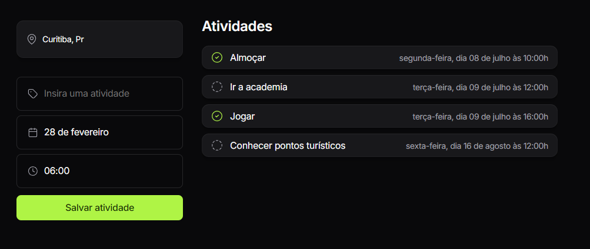

  

Projeto desenvolvido no NLW Journey da Rocketseat na trilha HTML+CSS+JS.

  <a href="#-tecnologias">Tecnologias</a>&nbsp;&nbsp;&nbsp;|&nbsp;&nbsp;&nbsp;
  <a href="#-projeto">Projeto</a>&nbsp;&nbsp;&nbsp;|&nbsp;&nbsp;&nbsp;
  <a href="#memo-licença">Licença</a>

<h2 id="layout">🎨 Layout</h2>

    

## 🚀 Tecnologias

Esse projeto foi desenvolvido com as seguintes tecnologias:

- HTML
- CSS
- JavaScript

## 💻 Projeto
Nesse projeto desenvolvemos uma versão simplificada de um sistema de roteiro de viagem.